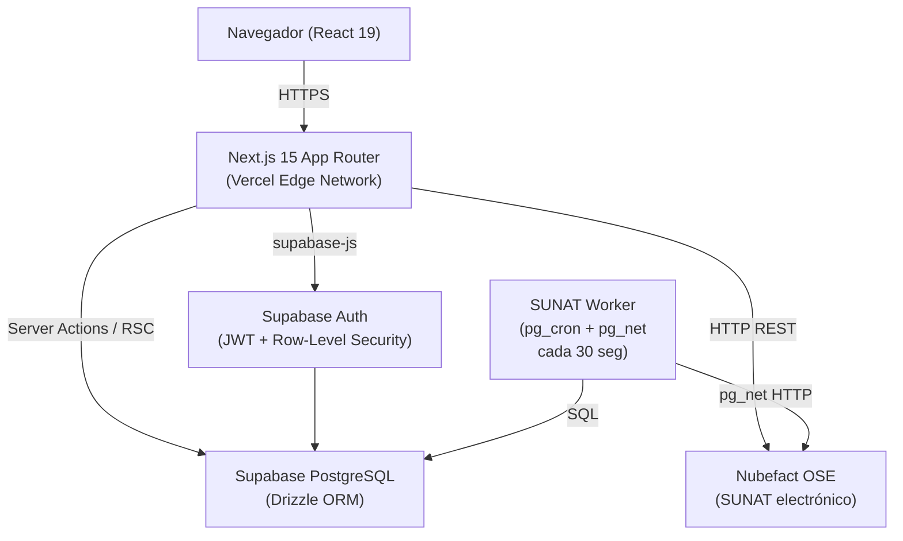

# Manual de Sistema — Orion ERP

### Grupo Idex SAC · v1.0 · Junio 2026

### Preparado por DIGNITA.TECH S.A.C.

---

## 1. Visión General

**Orion ERP** es un sistema de gestión comercial multi-tenant desarrollado por DIGNITA.TECH S.A.C. para PYMEs peruanas. Para Grupo Idex SAC, el sistema cubre el ciclo completo de ventas: desde cotización hasta factura electrónica SUNAT, pasando por gestión de catálogo, órdenes de compra a proveedores, inventario y guías de remisión electrónicas (GRE).

**URL de producción:** https://orion-rp.com/idex  
**Tenant:** Grupo Idex SAC (slug: `idex`, tenant_id: `1611fbf1-4f7b-4e8d-bb36-b7d3f8248507`)

### Usuarios del sistema

| Perfil          | Descripción                                                                             |
| --------------- | --------------------------------------------------------------------------------------- |
| **Admin**       | Acceso total: configuración, usuarios, roles, todos los módulos operativos              |
| **Comercial**   | Ventas: clientes, cotizaciones (crear/editar/enviar), productos (ver), inventario (ver) |
| **Facturación** | Billing: facturas, guías, crédito/CxC, cotizaciones (aprobar), inventario (ajustar)     |

> El sistema no implementa un perfil Superadmin distinto al Admin a nivel de tenant. La distinción Superadmin (plataforma) / Admin (tenant) existe en la arquitectura pero en el tenant Idex ambos apuntan al mismo conjunto de permisos.

---

## 2. Arquitectura



### Stack tecnológico

| Capa          | Tecnología                | Versión |
| ------------- | ------------------------- | ------- |
| Frontend      | Next.js App Router        | 15.4.8  |
| UI            | React                     | 19.0    |
| CSS           | Tailwind CSS              | 3.x     |
| Base de datos | Supabase PostgreSQL       | —       |
| ORM           | Drizzle ORM               | 0.45    |
| Auth          | Supabase Auth (SSR)       | 0.5     |
| RBAC          | Casbin (modelo ABACen BD) | —       |
| OSE (SUNAT)   | Nubefact REST API         | —       |
| Deploy        | Vercel (producción)       | —       |
| Node          | Node.js                   | ≥ 20    |

---

## 3. Estructura del Proyecto

```
src/
├── app/
│   ├── (auth)/login/           # Login, MFA, recuperación
│   ├── [tenant]/               # Rutas por tenant (slug dinámico)
│   │   ├── page.tsx            # Dashboard
│   │   ├── clientes/
│   │   ├── productos/
│   │   ├── cotizaciones/
│   │   ├── ordenes/
│   │   ├── inventario/
│   │   ├── guias/
│   │   ├── facturas/
│   │   ├── credito/
│   │   ├── pipeline/
│   │   ├── reportes/
│   │   ├── auditoria/
│   │   └── admin/ (usuarios, roles, configuración)
│   └── api/
│       └── sunat/procesar-cola/ # Worker endpoint (SUNAT_WORKER_SECRET)
├── server/actions/             # Server Actions (mutaciones)
├── lib/
│   ├── auth/                   # Casbin, permisos, tenant-access
│   ├── db/schema/              # Esquemas Drizzle
│   └── supabase/               # Clientes SSR/browser
├── components/                 # Componentes React
└── middleware.ts               # Auth + tenant resolution
supabase/
└── migrations/                 # 49 migraciones SQL
```

---

## 4. Módulos y Funcionalidades

### 4.1 Autenticación

- Supabase Auth (email + contraseña). JWT almacenado en cookie httpOnly vía `@supabase/ssr`.
- Middleware verifica sesión en TODAS las rutas protegidas y resuelve `tenant_id` desde `vw_user_tenant_access`.
- Rutas públicas: `/login`, `/api/sunat/procesar-cola` (con `SUNAT_WORKER_SECRET`), `/api/webhooks/nubefact`.

### 4.2 Dashboard

- KPIs en tiempo real: ventas USD/PEN del mes, clientes únicos, ticket promedio, CxC total, stock crítico.
- Gráficos: evolución ventas 12 meses, pipeline por etapa, top clientes y productos.
- Fuente: vistas materializadas `mv_ventas_mensuales`, `mv_top_clientes`, `mv_top_productos`.

### 4.3 Clientes

- CRUD completo. Campos: tipo doc, RUC/DNI, razón social, dirección, teléfono, email, límite de crédito.
- Exportar a Excel (requiere permiso `clientes.exportar`).

### 4.4 Productos

- Catálogo (no inventario por defecto). 476 productos activos (475 CELSA + 1 propio).
- Campos: SKU, nombre, categoría, unidad de medida, costo, precio de venta, controla_stock.
- `controla_stock = false` en todos los productos CELSA (modelo dropshipping).
- Importación masiva via UI (requiere `productos.importar`): actualmente la UI es un mock no funcional; la carga se realizó vía SQL directo.

### 4.5 Cotizaciones

- Ciclo: **Borrador → Enviada → Aceptada → Convertida**.
- Desde Aceptada: generar Factura o Orden de Compra.
- Vista lista y kanban. Filtros por estado, fecha, comercial, cliente.
- Política de márgenes: mínimo global configurable (actualmente 10%); cotizaciones >USD 5,000 requieren aprobación.
- PDF descargable desde el detalle.

### 4.6 Órdenes de Compra

- Ciclo: **Borrador → Enviada → Aprobada → Recibida**.
- Recepción parcial o total; al recibir actualiza el stock si `controla_stock = true`.

### 4.7 Inventario

- Ajustes manuales (entrada/salida con motivo).
- Kardex por producto (historial de movimientos con saldo acumulado).
- Stock crítico: productos por debajo del mínimo configurado (alerta en dashboard).

### 4.8 Guías de Remisión (GRE)

- Serie activa: **T001**.
- Integración Nubefact: envío automático vía worker (`pg_cron` cada 30 seg) o manual desde UI.
- Datos requeridos por SUNAT: RUC/DNI destinatario, dirección partida/llegada, transportista (RUC, licencia, placa), peso bruto total, líneas con código de unidad SUNAT (Cat. 3).

### 4.9 Facturas y Boletas

- Series activas: **F001** (facturas) y **F002** (notas de crédito) — ambas operativas en Nubefact; NC F002-1 aceptada por SUNAT el 10-jun-2026.
- Worker SUNAT procesa cola automáticamente cada 30 seg.
- Estados: Lista para emitir → Pendiente SUNAT → Aceptada/Rechazada SUNAT.
- Notas de Crédito: tipo 3 (devolución) y 4 (descuento).

### 4.10 Crédito y CxC

- Aging report (Al día / 1-30d / 31-60d / 61-90d / +90d).
- Límite de crédito por cliente; alerta al superar.
- Registro de pagos.

### 4.11 Pipeline

- Kanban 6 etapas: Prospecto → Calificado → Propuesta → Negociación → Ganado → Perdido.
- Vinculado a cotizaciones.

### 4.12 Reportes

- Ventas, cotizaciones, precios, inventario. Exportar a Excel (requiere `reportes.exportar`).

### 4.13 Auditoría

- Log de todas las acciones del sistema (quién, qué, cuándo). Solo Admin.

### 4.14 Usuarios y Roles

- Invitación por email. Roles predefinidos + roles personalizables.
- Matriz de permisos granular por módulo/acción.

### 4.15 Configuración

- Empresa (logo, RUC, dirección).
- Comercial (margen mínimo, aprobación, IGV, descuentos por línea).
- Facturación SUNAT (credenciales Nubefact, series activas).

---

## 5. Base de Datos / Modelo de Datos

### Tablas principales

| Tabla                                | Descripción                         |
| ------------------------------------ | ----------------------------------- |
| `tenants`                            | Empresas en la plataforma           |
| `users` / `tenant_users`             | Usuarios y su vínculo al tenant     |
| `roles` / `rol_permisos`             | RBAC granular por tenant            |
| `permisos_definidos`                 | Catálogo de 60 permisos disponibles |
| `clientes`                           | Clientes del tenant                 |
| `productos`                          | Catálogo de productos               |
| `categorias_producto`                | Familias/categorías                 |
| `cotizaciones` / `cotizacion_lineas` | Cotizaciones y sus líneas           |
| `ordenes_compra` / `orden_lineas`    | OC a proveedores                    |
| `movimientos_inventario`             | Kardex (entradas/salidas/ajustes)   |
| `guias_remision` / `guia_lineas`     | GRE y sus líneas                    |
| `facturas` / `factura_lineas`        | Facturas/boletas/NC                 |
| `sunat_outbox`                       | Cola de envío a SUNAT (worker)      |
| `cuentas_por_cobrar`                 | CxC vinculadas a facturas           |
| `pagos`                              | Pagos registrados                   |
| `audit_log`                          | Log de auditoría                    |

### Row-Level Security (RLS)

Todas las tablas operativas tienen RLS habilitado. El patrón es:

```sql
USING (tenant_id = (SELECT tenant_id FROM vw_user_tenant_access
       WHERE user_id = auth.uid() LIMIT 1))
```

Garantiza aislamiento total entre tenants. Ningún usuario puede ver datos de otro tenant aunque conozca el ID.

---

## 6. Matriz de Permisos por Perfil

| Módulo / Acción                                 | Admin (superadmin) | Comercial   | Facturación |
| ----------------------------------------------- | ------------------ | ----------- | ----------- |
| **Clientes** ver                                | ✅                 | ✅          | ✅          |
| **Clientes** crear/editar                       | ✅                 | ✅          | ❌          |
| **Clientes** eliminar/exportar                  | ✅                 | ✅ exportar | ❌          |
| **Productos** ver                               | ✅                 | ✅          | ✅          |
| **Productos** ver costo                         | ✅                 | ❌          | ✅          |
| **Productos** crear/editar                      | ✅                 | ❌          | ❌          |
| **Productos** importar                          | ✅                 | ✅          | ❌          |
| **Cotizaciones** ver                            | ✅                 | ✅          | ✅          |
| **Cotizaciones** crear/editar/enviar            | ✅                 | ✅          | ❌          |
| **Cotizaciones** aceptar/rechazar               | ✅                 | ❌          | ❌          |
| **Cotizaciones** aprobar                        | ✅                 | ❌          | ✅          |
| **Cotizaciones** cambiar margen                 | ✅                 | ❌          | ❌          |
| **Cotizaciones** descuento excepcional          | ✅                 | ❌          | ❌          |
| **Órdenes** ver                                 | ✅                 | ✅ ver      | ❌          |
| **Órdenes** crear/editar/enviar/aprobar/recibir | ✅                 | ❌          | ❌          |
| **Inventario** ver                              | ✅                 | ✅          | ✅          |
| **Inventario** ajuste manual                    | ✅                 | ❌          | ✅          |
| **Facturas** ver                                | ✅                 | ❌          | ✅          |
| **Facturas** crear/emitir/anular                | ✅                 | ❌          | ✅          |
| **Guías** ver/crear/anular                      | ✅                 | ❌          | ✅          |
| **Guías** emitir SUNAT                          | ✅                 | ❌          | ❌          |
| **Crédito/CxC** ver                             | ✅                 | ❌          | ✅          |
| **Crédito** otorgar/registrar pago              | ✅                 | ❌          | ✅          |
| **Reportes** ver                                | ✅                 | ✅          | ✅          |
| **Reportes** exportar                           | ✅                 | ❌          | ✅          |
| **Admin** usuarios/roles/config                 | ✅                 | ❌          | ❌          |

---

## 7. Flujos Principales por Perfil

### Admin — Flujo de venta completo

1. Login → Dashboard (KPIs del mes)
2. Clientes → buscar o crear cliente
3. Cotizaciones → Nueva cotización → agregar productos → guardar borrador → enviar → aceptar
4. Desde cotización aceptada → Convertir a factura → Emitir → SUNAT acepta
5. Desde cotización aceptada → Generar OC → proveedor confirma → Recibir mercadería
6. Guías → Nueva guía → completar datos de traslado → Enviar a SUNAT
7. Crédito y CxC → verificar pago recibido → Registrar pago

### Comercial — Flujo de cotización

1. Login → Clientes → verificar cliente existe o crear nuevo
2. Cotizaciones → Nueva → seleccionar cliente y productos → guardar borrador
3. Enviar al cliente (borrador → enviada)
4. Esperar respuesta del cliente → Marcar como aceptada o rechazada
5. Si aceptada y >USD 5,000: esperar aprobación del Admin antes de continuar

### Facturación — Flujo de factura y cobro

1. Login → Cotizaciones → filtrar por Aceptadas
2. Abrir cotización → Convertir a factura → revisar líneas e IGV → Emitir
3. Verificar estado SUNAT (Aceptada / Rechazada)
4. Si hay error: Facturas → reenviar a SUNAT
5. Crédito y CxC → confirmar CxC generada → registrar pago cuando llegue

---

## 8. APIs y Endpoints

| Método | Ruta                       | Descripción                     | Auth                         |
| ------ | -------------------------- | ------------------------------- | ---------------------------- |
| POST   | `/api/sunat/procesar-cola` | Worker SUNAT (facturas + guías) | `SUNAT_WORKER_SECRET` header |
| POST   | `/api/webhooks/nubefact`   | Callback de Nubefact            | `NUBEFACT_WEBHOOK_SECRET`    |
| GET    | `/api/auth/callback`       | Callback OAuth de Supabase      | Público                      |
| POST   | `/api/auth/logout`         | Cerrar sesión                   | JWT                          |
| GET    | `/api/health`              | Health check                    | Público                      |

El resto de operaciones son **Server Actions** de Next.js (no endpoints REST tradicionales).

---

## 9. Variables de Entorno

```env
# Supabase
NEXT_PUBLIC_SUPABASE_URL=https://[PROJECT_ID].supabase.co
NEXT_PUBLIC_SUPABASE_ANON_KEY=[ANON_KEY]
SUPABASE_SERVICE_ROLE_KEY=[SERVICE_ROLE_KEY]   # Solo server-side

# Nubefact OSE
NUBEFACT_URL=https://api.nubefact.com/api/v1
NUBEFACT_TOKEN=[TOKEN_OSE]

# Worker SUNAT
SUNAT_WORKER_SECRET=[SECRET_LARGO_RANDOM]
CRON_SECRET=[SECRET_CRON]                       # pg_cron auth

# Nubefact Webhook
NUBEFACT_WEBHOOK_SECRET=[SECRET_WEBHOOK]

# App
NEXT_PUBLIC_APP_URL=https://orion-rp.com
```

---

## 10. Instalación y Despliegue

### Producción (Vercel)

1. Repositorio en GitHub (org `orionrp-hub`, repo privado).
2. Vercel conectado al repo — deploy automático en push a `main`.
3. Variables de entorno configuradas en Vercel Dashboard.
4. Supabase proyecto `aycraotcdbunybfjzlmq` — migraciones aplicadas vía `supabase db push`.

### Local

```bash
# Requisitos: Node >=20, pnpm
pnpm install
cp .env.example .env.local
# Completar credenciales en .env.local
pnpm dev
```

---

## 11. Consideraciones de Seguridad y Roles

1. **Tenant isolation**: RLS en todas las tablas — verificado. Ninguna query puede cruzar tenants.
2. **Middleware auth**: todas las rutas (excepto PUBLIC_PATHS) verifican JWT con Supabase antes de renderizar.
3. **RBAC vía Casbin**: `requirePermission(permiso)` en Server Actions valida permiso antes de ejecutar. `requirePermissionPage(permiso, slug)` redirige en lugar de lanzar 500.
4. **Worker SUNAT**: autenticado con `SUNAT_WORKER_SECRET` (no expuesto al navegador). El endpoint es público pero requiere el header secreto para procesar.
5. **Secretos**: nungún secreto en código fuente. Todos en variables de entorno de Vercel.
6. **Supabase Service Role**: usado solo en Server Actions server-side, nunca expuesto al cliente.

---

## 12. Auditoría de Problemas Detectados

### ISSUE-01 — Importación masiva de productos (UI mock)

- **Severidad:** MEDIO
- **Perfil afectado:** Admin, Comercial
- **Archivo:** `src/app/[tenant]/productos/importar/ProductosImportar.tsx`
- **Descripción:** La UI de importación muestra 9 filas de datos automotrices hardcodeados (`INITIAL_ROWS`) y nunca escribe en la BD. `onConfirm` solo llama `setStep(3)` sin ejecutar ninguna acción.
- **Evidencia:** `const INITIAL_ROWS = [...]` con datos de prueba y `const handleFile = (f) => setFileName(f.name)` sin parsear.
- **Impacto:** El usuario cree que importó productos pero no se guardó nada.
- **Solución sugerida:** Implementar parsing real de Excel con `exceljs` + Server Action de inserción masiva. **En roadmap v2.**
- **Estado:** Los 475 productos CELSA se cargaron vía SQL directo. Workaround documentado.

### ISSUE-02 — Serie F002 (Notas de Crédito) no emite a SUNAT — ✅ RESUELTO

- **Severidad:** MEDIO → cerrado
- **Perfil afectado:** Admin, Facturación
- **Descripción:** Se sospechaba que el worker SUNAT no procesaba las NC de la cola.
- **Resolución (verificada 11-jun-2026):** La NC F002-1 fue procesada por el worker y **ACEPTADA por SUNAT** (código 0, "La Nota de credito numero F002-1, ha sido aceptada"), vinculada a la factura F001-14. El ciclo completo de NC funciona de punta a punta con la serie F002 operativa en Nubefact.

### ISSUE-03 — Guía T001-00000007 en estado "Error red"

- **Severidad:** BAJO
- **Perfil afectado:** Admin, Facturación
- **Descripción:** La guía T001-7 fue creada con datos incompletos (peso=0, sin códigos de unidad SUNAT válidos). Nubefact la rechazó.
- **Impacto:** Registro de prueba inválido en el historial. No afecta guías nuevas.
- **Solución sugerida:** Anular el registro o marcarlo como prueba descartada.

### ISSUE-04 — Error 404 en prefetch de /idex/admin

- **Severidad:** BAJO
- **Perfil afectado:** Admin
- **Descripción:** Next.js RSC intenta prefetch de `/idex/admin` (ruta que no existe como página — solo existen `/idex/admin/usuarios` y `/idex/admin/roles`). Aparece en consola como 404.
- **Impacto:** Error en consola del navegador únicamente. No afecta funcionalidad.
- **Solución sugerida:** Agregar `src/app/[tenant]/admin/page.tsx` con redirect a `/[tenant]/admin/usuarios`. **Fix menor.**

### ISSUE-05 — Logo URL es placeholder

- **Severidad:** BAJO
- **Perfil afectado:** Admin
- **Descripción:** En Configuración → Empresa, el campo "URL del logo" tiene el valor `https://ejemplo.com/logo.png`. No se ha cargado el logo real de Grupo Idex SAC.
- **Impacto:** El sidebar muestra el nombre de texto "GRUPO IDEX SAC" sin logo visual real; los PDFs de cotizaciones no tienen el logo del cliente.
- **Solución sugerida:** Lucas debe proveer el logo (PNG, fondo transparente). Se sube a un CDN o Supabase Storage y se actualiza la URL en Configuración.

---

**Resumen de auditoría:** 5 issues detectados — 0 críticos, 0 altos, 1 medio, 3 bajos (ISSUE-02 resuelto y verificado 11-jun).  
Los 2 issues medios (importación mock + NC sin SUNAT) son funcionalidades incompletas documentadas en el alcance: la importación era workaround, y las NC requieren paso adicional en Nubefact. No bloquean la operación diaria.
